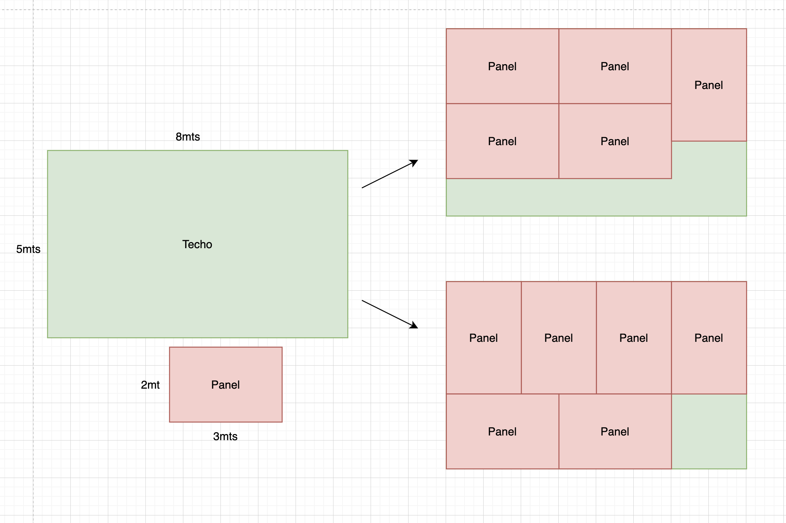

# Prueba paneles solares ruuf.

- [Prueba paneles solares ruuf.](#prueba-paneles-solares-ruuf)
    - [Como abordé el problema?](#como-abordé-el-problema)
    - [Otro caso borde que me pareció interesante](#otro-caso-borde-que-me-pareció-interesante)
    - [Como ejecutar el código](#como-ejecutar-el-código)
    - [Complejidad del algoritmo.](#complejidad-del-algoritmo)
    - [Limitaciones y posibles extensiones del problema.](#limitaciones-y-posibles-extensiones-del-problema)

### Como abordé el problema?

Al recibir el problema mis primeros pensamientos fueron "que ejercicio más facil". Nada más lejos de la realidad.
Mi primer acercamiento a la solución fue simplemente decir "hay que calcular el área del techo y dividirlo por el area del panel" ya que con rectangulos siempre podré teselar cualquier superficie, quedandome un espacio solamente cuando ya no quepan más paneles.
Al ponerme a pensar en casos borde me di cuenta que esta solución no era correcta ya que por ejemplo si tengo un panel cuyo ancho es de 2mts y tengo un techo de 1mt de ancho, da lo mismo el largo del techo, jamás podré colocar un panel en el techo. Como el de la foto

Luego dije, con un rectangulo siempre podré teselar toda la superficie de otro rectangulo. Si me pongo a colocar paneles de izquierda a derecha, de arriba a bajo luego de que no pueda poner el siguiente panel, estaré listo. Después de intentar con un par de casos me di cuenta de que tampoco bastaba ya que la orientación del panel afectaba en la cantidad máxima que podía colocar. Por ejemplo en esta imagen si primero colocaba los paneles en la orientación inicial, solo me cabían 5. Pero si primero rotaba el panel en 90° me cabían 6. Además aqui me di cuenta que al ir poniendo paneles en una orientación primero, siempre iba a quedar con un espacio libre tanto a la derecha como abajo donde podían caber más paneles.

Con esto ya tenía más o menos una aproximación de como iba a abordar el problema. Primero iba a intentar una orientación, poner paneles hasta que no quepan más. Luego volver a repetir el proceso en los espacios sobrantes de la derecha y de abajo. Con esto tendría los valores para ambas orientaciones iniciales y me quedaría con aquella que cupieran más. Que fue la solución que terminé implementando. 

### Otro caso borde que me pareció interesante

Para un techo de 4x4 y un panel de 1x3, puedo poner 4 paneles y despues en el espacio sobrante poner uno más haciendo un total de 5 como se muestra en la imagen

Luego pensé, que si el techo mide un milimetro menos o el panel mide un milimetro más, ya no cabría el quinto panel como se muestra en la foto. Mi algoritmo debía ser robusto y considerar estos casos.

También me pareció interesante probar con un techo muy grande donde quepan muchos paneles para asegurarme que mi código era eficiente independiente de la cantidad de paneles. 

### Como ejecutar el código

Dentro del archivo `prueba_ruuf.py` se encuentra la función `max_paneles(W, H, w, h)` que es la que calcula la cantidad máxima de paneles que de (w x h) que caben dentro de un techo de (W x H). Dentro del archivo también deje la ejecución de varios casos de pruebas (como los que explique en el archivo y otros que me sirvieron para ir debuggeando) junto con un comentario del valor esperado de cada caso de prueba. Se podrían haber hecho con el formato de tests unitarios pero creo que no era el espiritu de este ejercicio. Estos casos se pueden modificar a gusto del ejecutor para probar otros casos. 

### Complejidad del algoritmo.

En mi codigo, como el llamado recursivo se hace disminuyendo el largo y ancho del techo a una dimensión donde ya no caben más paneles en una de las direcciones, al siguiente llamado se disminuirá al maximo la otra dimensión al mínimo. Es por esto que además de la llamada principal, como máximo se llamará 4 veces más a la función principal. Haciendo que la complejidad del algoritmo sea `O(1)`.
Además no se definen estructuras de datos que dependan del largo del techo, ni del largo del panel ni de cuantos paneles caben, haciendo que la complejidad de memoria también sea `O(1)`

### Limitaciones y posibles extensiones del problema.

Luego de realizar el ejercicio me quede pensando un poco más sobre el problema. Pensé en el caso de un panel que fuese más largo que el largo del techo pero más pequeño que la diagonal del techo. Fue aqui cuando me dí cuenta de la verdadera complejidad del problema. 
Mi solución solo considera rotaciones en 90° de los paneles haciendo calzar los angulos de 90° del techo con el del panel. 

Luego de una pequeña investigación vi que hay casos incluso más complejos donde aprovechandose de la diagonal de los paneles se hacía caber un panel más. Nuevamente me parecio demasiado complejo para el espiritu del ejercicio, pero es bueno tenerlo en cuenta y saber que existen otros casos. 

